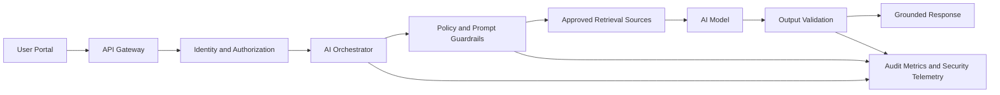

# Interview Command Center — Application User Guide

> Walkthrough-based operating guide, UX narrative, privacy/security controls, and AI integration model.

## 1. Purpose and Scope

Interview Command Center is a focused interview-preparation workspace that combines an AI Copilot prompt, an interview camera panel, a Smart Flashcards workspace, a Confidence Room for guided rehearsal, and an Interview Coach conversation panel. This guide is based on the supplied video walkthrough and explains the visible user journey while documenting recommended technical standards for secure, private, and responsible AI operation.

## 2. Interface Overview

The interface uses a dashboard pattern: persistent context at the top, then task-specific cards below. The strongest design theme is parallel preparation. A user can ask the Copilot for help, rehearse with flashcards, practice a spoken answer, and consult the Interview Coach without navigating away from the interview context.

## 3. Quick Start

1. **Review the interview context.** Read the Copilot role summary, mission/vision, and role-aligned talking points before beginning practice.
2. **Start the camera when ready.** Use the Interview Camera card only when visual rehearsal is desired. Camera access should be permission-based and visibly indicated.
3. **Generate a flashcard.** Choose or retain the desired deck, enter a role-specific question, then use the card controls to reveal or move through prompts.
4. **Practice in the Confidence Room.** Select a rehearsal mode and use the prompt area to practice concise, evidence-based answers.
5. **Ask the Interview Coach.** Enter a question or request targeted coaching. The walkthrough demonstrates iterative prompts and progressively richer coach responses.
6. **Review and refine.** Compare the response against the role requirements, tighten the STAR structure, and repeat practice until the answer is concise and evidence-based.

## 4. Smart Flashcards Workflow

The Smart Flashcards card supports retrieval practice rather than passive reading. The user selects a deck, reviews a prompt, attempts an answer, and then reveals the prepared response. This is efficient because it turns role research into short rehearsal loops.

For AI-generated cards, the system should retain source provenance, distinguish generated content from user-authored content, and allow correction before reuse.

## 5. Confidence Room Workflow

The Confidence Room is designed as a low-friction rehearsal space. A user can choose a practice mode, enter or receive a prompt, and rehearse an answer without leaving the dashboard.

Recommended response structure:

1. Situation
2. Task
3. Action
4. Result
5. Technical reflection

The system should avoid scoring personality, emotion, accent, disability, or other sensitive human traits. Feedback should focus on observable answer structure, relevance, completeness, pacing, and evidence.

## 6. Interview Coach Workflow

The Interview Coach uses an iterative conversational pattern. The walkthrough shows a user entering questions and receiving role-aware coaching responses.

A strong implementation should use retrieval-augmented generation over approved job descriptions, resume content, project narratives, and curated interview frameworks. The assistant should identify the source context used for factual claims and should not invent employment history, metrics, certifications, or project outcomes.

## 7. Design Themes and Efficiency Narrative

| Design Theme | Observed Benefit | Recommended Standard |
|---|---|---|
| Single-screen command center | Reduces context switching across preparation tasks | Keep primary actions visible; use progressive disclosure for advanced controls |
| Card-based modularity | Separates AI, camera, flashcards, rehearsal, and coaching concerns | Each card should have idle, loading, success, error, and permission-denied states |
| Role-context persistence | Keeps preparation anchored to the target interview | Version job context and show when AI answers are grounded in it |
| Conversational iteration | Supports refinement instead of one-shot answers | Preserve context with user-controlled reset and deletion |
| Practice loops | Encourages active recall and repeated rehearsal | Track progress with minimal data retention and transparent controls |

## 8. Privacy and Security Standards

The application handles potentially sensitive material: resumes, employment history, interview recordings, camera feeds, voice content, job descriptions, and AI conversation history. The recommended control model is privacy by design and least privilege.

- Require explicit camera and microphone consent; do not capture in the background before user activation.
- Display a visible recording state and immediate stop/delete controls.
- Encrypt data in transit with modern TLS and encrypt data at rest using managed keys.
- Use short retention periods for audio/video by default, with user-controlled deletion and export.
- Do not use interview recordings or private resume content for model training without explicit, separate consent.
- Apply role-based access control, strong authentication, session expiration, and administrative audit logging.
- Keep secrets outside source code; rotate credentials and use workload identities where possible.
- Enforce input validation, output encoding, dependency scanning, SAST, DAST, IAST, container scanning, and SBOM generation in CI/CD.
- Defend against prompt injection in retrieved documents using trust boundaries, content labeling, allowlisted tools, and human approval for consequential actions.
- Minimize PII before log aggregation and redact tokens, email addresses, phone numbers, and private document content from telemetry.

## 9. AI Integration Architecture

A production implementation should separate the user experience from AI orchestration. The portal sends a scoped request to an AI orchestration layer. That layer retrieves only authorized context, applies policy checks, invokes the model, validates output, and returns a response with provenance metadata.

Tool-using agents should operate with least-privilege credentials and explicit action boundaries.

## 10. Responsible AI Enforcement

- Ground coaching in approved user-provided or curated sources.
- Never fabricate resume achievements or interview outcomes.
- Separate suggestions from verified facts.
- Provide a user-visible way to correct AI-generated flashcards and coaching content.
- Do not infer protected or highly sensitive traits from camera, voice, or language patterns.
- Use human review for consequential decisions; the tool should coach the candidate, not rank or reject people.
- Evaluate hallucination rate, groundedness, latency, unsafe output, prompt injection, and retrieval leakage.

## 11. Operational Metrics

| Area | Example Measures |
|---|---|
| UX | time to first useful coaching response; flashcard completion rate; rehearsal-session completion; error recovery rate |
| AI quality | groundedness; provenance coverage; hallucination rate; correction rate; user acceptance of suggestions |
| Security | authentication failures; anomalous access; prompt-injection detections; blocked tool calls; secret/PII leakage events |
| Reliability | p50/p95 response latency; AI timeout rate; camera permission failures; API error rate; availability |

## 12. Suggested Future Enhancements

- Role-specific interview plans generated from a job description with user approval.
- Source-backed answer coaching using resume and project evidence.
- Session timeline showing practiced questions, revisions, and confidence notes.
- Exportable interview preparation packet with user-selected content only.
- Privacy center showing retained documents, recordings, conversations, and deletion controls.
- AI evaluation dashboard for groundedness, latency, safety events, and retrieval quality.

---

Prepared from the supplied Interview Command Center video walkthrough. The original DOCX guide contains walkthrough frame captures; this repository-native Markdown version is optimized for GitHub navigation and review.