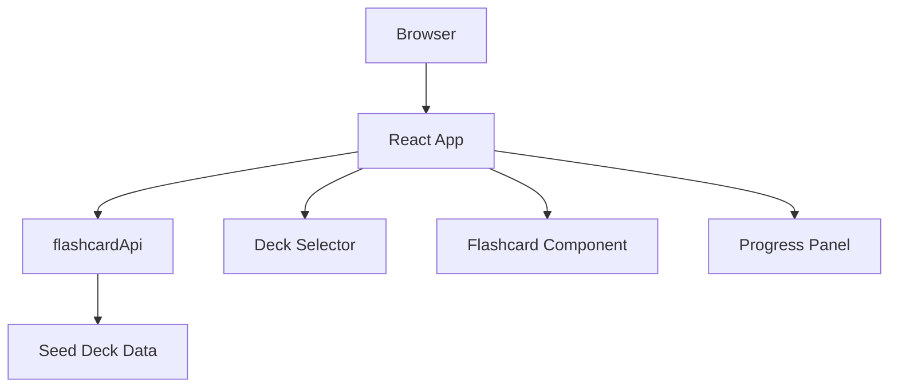
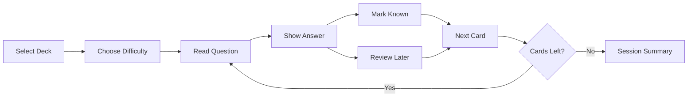

# Architecture

## Runtime Structure

## Module Responsibilities

| Path | Responsibility |
| --- | --- |
| `src/main.jsx` | Application state, deck selection, review workflow, scoring |
| `src/api/flashcardApi.js` | API boundary for seed data now and backend integration later |
| `src/data/seedDecks.js` | Computer science and project management interview questions |
| `src/components/DeckSelector.jsx` | Deck and difficulty controls |
| `src/components/Flashcard.jsx` | Question/answer card rendering |
| `src/components/ProgressPanel.jsx` | Session progress and scoring display |
| `legacy/java` | Original Java Swing implementation retained for reference only |

## Review Workflow

