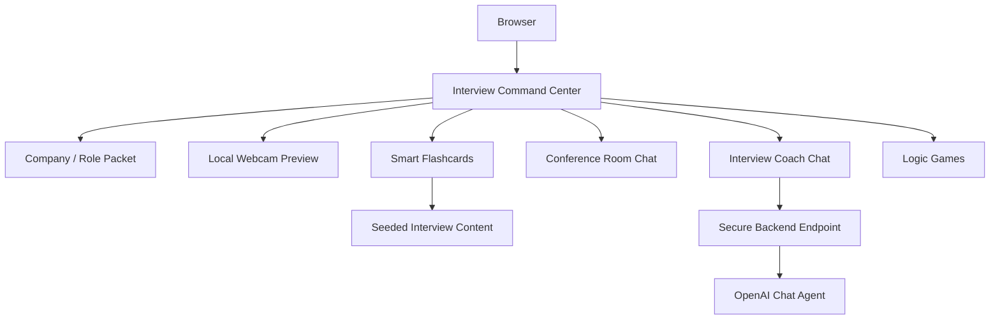
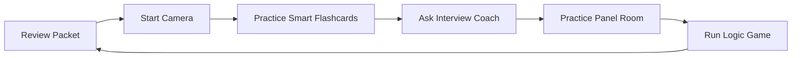

# Architecture

## Application Structure

## Security Model

- Webcam video is local to the browser and is not uploaded by this app.
- OpenAI keys must never be placed in client-side code.
- The browser calls `VITE_INTERVIEW_COACH_ENDPOINT` only when configured.
- A backend should validate input, authenticate users if needed, rate-limit requests, and call OpenAI server-side.

## Module Responsibilities

| Path | Responsibility |
| --- | --- |
| `src/main.jsx` | Consolidated dashboard, state, webcam, room chat, coach chat, flashcards, logic games |
| `src/data/interviewContent.js` | Company packet, seeded job description, rooms, games, credential flashcards |
| `src/services/coachService.js` | Secure API-boundary client with local fallback |
| `src/styles/app.css` | Responsive visual system |
| `legacy/java` | Original Flashcard Java app retained for reference |

## Workflow

## Credential Mapper

The credential mapper is written around DoD 8140-era workforce qualification language while acknowledging legacy 8570 baseline certification familiarity. It is a study aid, not an official compliance determination.
